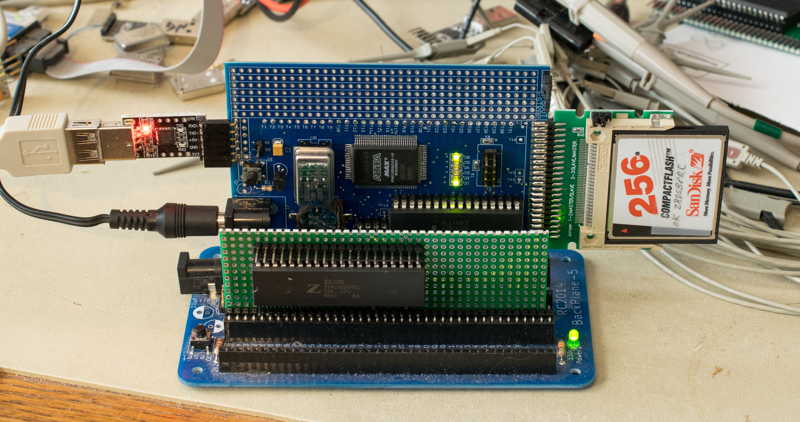

# G8PP-Z80
G8PP is a prototype board for 8-bit processors. The target processors are Z80, 8085, 680x, 6502, as well as 16-bit processors with 8-bit bus. G8PP is a RC2014 bus compatible module to take advantage of various I/O modules of the RC2014 family.

G8PP-Z80 is a Z80 modular computer consisted of
- RC2014 backplane
- [G8PP baseboard](https://github.com/Plasmode/G8PP/tree/master/G8PP_Rev0)
- [Z80 board](https://github.com/Plasmode/G8PP/tree/master/Z80)

### Design Information
- CPLD design files for G8PP baseboard

### Software

